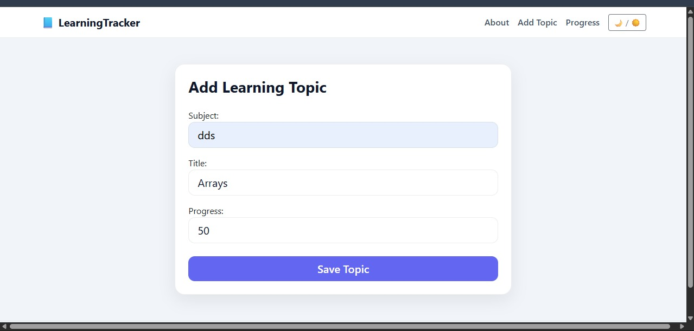
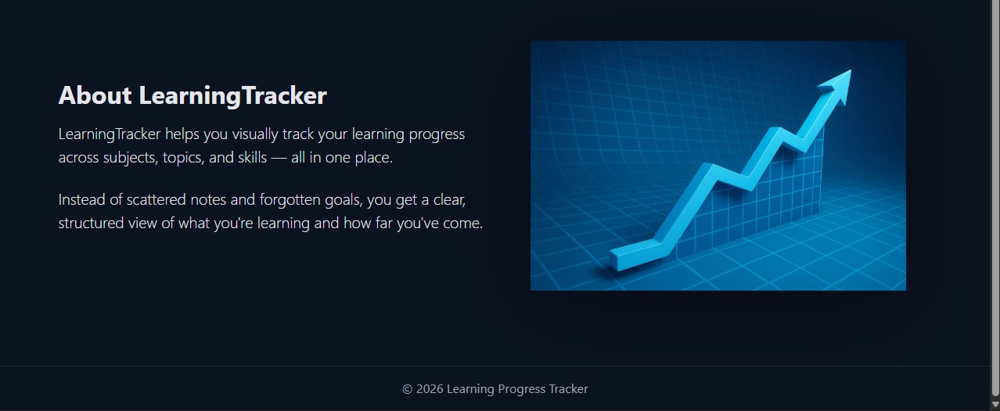

# 📘 Learning Tracker

A clean and minimal Django web app to track learning progress across subjects and topics.

Built to stay consistent, not overwhelmed.

---
## Screenshots

### Home Page


### Add Topic


### Progress Dashboard


### About Page


## 🚀 Features

- Add learning topics with subject and progress percentage
- Update and delete topics easily
- Visual progress overview (Not Started / In Progress / Completed)
- Clean UI with dark & light mode
- Responsive layout
- Input validation using Django ModelForms

---

## 🛠 Tech Stack

- **Backend:** Django
- **Frontend:** HTML, CSS, Bootstrap
- **Database:** SQLite (default)
- **Version Control:** Git & GitHub

---

## 📂 Project Structure
learning_tracker/
│
├── learning_tracker/ # Django project (settings, urls, wsgi)
├── tracker/ # Main app (models, views, forms)
├── templates/ # HTML templates
├── static/ # CSS, JS, images
├── manage.py
├── requirements.txt
└── README.md


---

## ⚙️ Setup Instructions (Local)

### 1️⃣ Clone the repository

```bash
git clone https://github.com/Manav-cmd/Learning_Tracker.git
cd Learning_Tracker
2️⃣ Create and activate virtual environment
python -m venv venv


Windows

venv\Scripts\activate


Mac/Linux

source venv/bin/activate

3️⃣ Install dependencies
pip install -r requirements.txt

4️⃣ Apply migrations
python manage.py migrate

5️⃣ Run the development server
python manage.py runserver


Open:

http://127.0.0.1:8000/

🧠 How It Works

models.py defines the data structure (Topic)

forms.py handles validation and safe input

views.py controls request flow

templates render UI

CSS variables power dark/light theme

Business logic stays out of templates (clean separation)

🔐 Validation Rules

Progress must be between 0 and 100

Empty fields are not allowed

Invalid input never reaches the database

📌 Future Improvements

User authentication

Topic categories & tags

Progress analytics

Deployment with custom domain

PostgreSQL for production

👤 Author

Manav Nenwani
B.Tech CSE Student
Focused on building clean, practical projects.

📄 License

This project is open-source and free to use for learning purposes.
